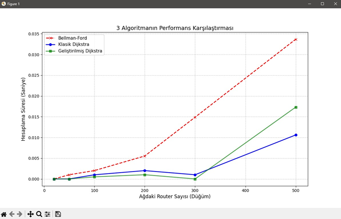
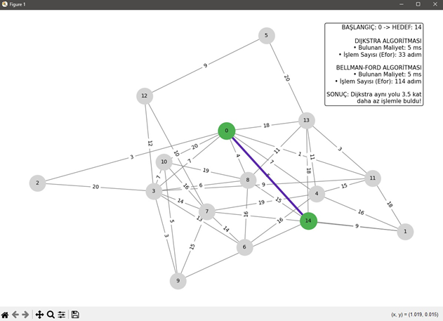
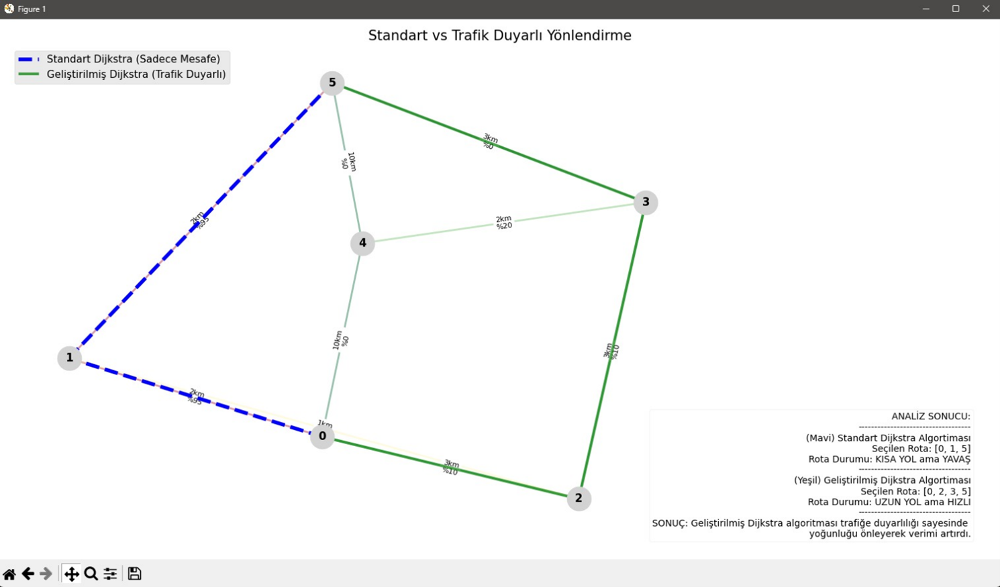

# 🌐 Yönlendirme Protokollerinde En Kısa Yol Optimizasyonu

Bu proje, bilgisayar ağlarında veri paketlerinin yönlendirilmesi (routing) sırasında karşılaşılan trafik sıkışıklığı ve darboğaz problemlerini analiz etmek üzere geliştirilmiş kapsamlı bir ağ simülasyonu ve algoritma tasarımı çalışmasıdır. Proje kapsamında, geleneksel Dijkstra ve Bellman-Ford algoritmalarının dinamik ağ koşullarındaki yetersizlikleri incelenmiş ve bu soruna çözüm olarak "Trafik Duyarlı Dinamik Yönlendirme Algoritması" geliştirilmiştir.

## 🚀 Proje Özeti ve Amacı
Geleneksel yönlendirme algoritmaları genellikle sadece fiziksel mesafeye veya bant genişliğine odaklanan "kör" bir yapıya sahiptir. Bu proje, "en kısa yolun" her zaman "en hızlı" veya "en verimli" yol olmadığı hipotezini kanıtlamayı ve mühendislik tabanlı bir çözüm üretmeyi amaçlar.

* **Dinamik Maliyet Fonksiyonu:** Anlık hat doluluk oranlarını bir ceza katsayısı ile maliyet fonksiyonuna dahil eder.
* **Optimizasyon:** Veri trafiğini yoğun hatlardan uzaklaştırarak daha uzun ancak daha akıcı alternatif rotalara yönlendirir.
* **Analiz:** Algoritmaları işlemci süresi, zaman karmaşıklığı ve rota verimliliği açısından kıyaslar.

## 🛠️ Teknik Özellikler ve Metot
* **Dil:** Python
* **Kütüphaneler:** `NetworkX` (Çizge teorisi), `Matplotlib` (Görselleştirme), `heapq` (Öncelik kuyruğu optimizasyonu).
* **Topoloji:** 50 adet yönlendirici düğümden oluşan "Rastgele Geometrik Çizge" modeli kullanılmıştır.
* **Maliyet Formülü:** $Maliyet = Mesafe \times (1 + (Trafik \: Yoğunluğu \times Ceza \: Katsayısı))$

---

## 📊 Algoritma Karşılaştırmaları

### 1. İşlemci Performansı
Düğüm sayısı arttıkça Bellman-Ford algoritması çizgisel olmayan bir süre artışı sergilerken, geliştirilen Trafik Duyarlı algoritma Klasik Dijkstra ile benzer şekilde yüksek ölçeklenebilirlik sunar.

### 2. Adım Sayısı Verimliliği
Dijkstra tabanlı yaklaşım, aynı en kısa yolu bulurken Bellman-Ford'a göre yaklaşık 3.5 kat daha az işlem adımı gerçekleştirerek işlemci yükünü minimize eder.

### 3. Trafik Farkındalığı
Standart Dijkstra, %95 doluluk oranına sahip kısa yolu seçip darboğaza girerken; Geliştirilmiş Algoritma, trafiği tespit ederek daha uzun ama akıcı olan rotayı tercih eder.

---

## 👥 Geliştiriciler
* **Özgür Taşkıran** 
* **Ömer Faruk Aşkın** 

---
*Bu çalışma, Gazi Üniversitesi Teknoloji Fakültesi Bilgisayar Mühendisliği Bölümü BMT-317 Algoritmalar dersi dönem sonu projesi kapsamında hazırlanmıştır.*
